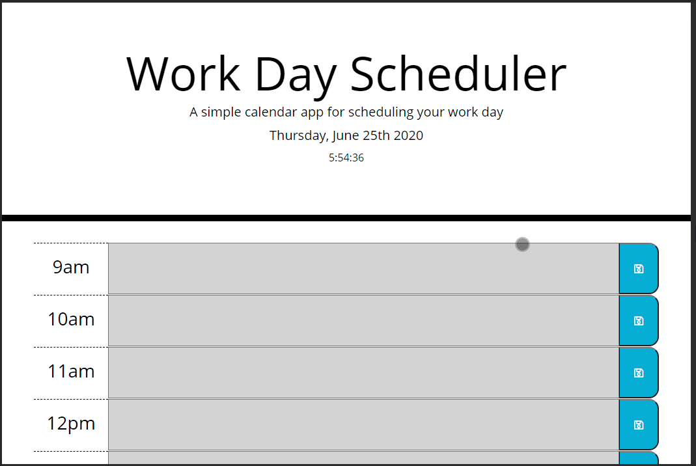

# Daily Scheduler

## Objective
To create daily scheduler to plan out the users' day. 

View the site [here](https://eddyangang.github.io/scheduler/).

## User requirements
## User Story

```
AS AN employee with a busy schedule
I WANT to add important events to a daily planner
SO THAT I can manage my time effectively
```

## Acceptance Criteria

```
GIVEN I am using a daily planner to create a schedule
WHEN I open the planner
THEN the current day is displayed at the top of the calendar
WHEN I scroll down
THEN I am presented with timeblocks for standard business hours
WHEN I view the timeblocks for that day
THEN each timeblock is color coded to indicate whether it is in the past, present, or future
WHEN I click into a timeblock
THEN I can enter an event
WHEN I click the save button for that timeblock
THEN the text for that event is saved in local storage
WHEN I refresh the page
THEN the saved events persist
```

## Checklist of criteria

✅ The current day is displayed that the top of the calender.

✅ Timeblocks are displayed in hour increments for stadard business hours.

✅ Each timeblock is color coded to indicate past, present, or future times. 

✅ Input can is placed in each timeblock.

✅ When the save button is pressed, input for that timeblock is saved into local        storage on browser.

✅ When the page is refreshed, saved events will presist on the timeblock.

## Preview
[Link to live server](https://eddyangang.github.io/scheduler/)

